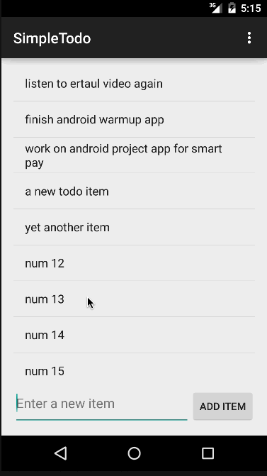

# SimpleTodo

This is a simple Android Todo application.

Time spent: 6 hours

Completed user stories:
 * [x] View todo list
 * [x] Add todo item
 * [x] Remove todo item
 * [x] Edit a todo item
 * [x] Persist todo list and retrieve them on app restart
 * [x] Use DialogFragment instead of a new Activity to edit items
 
Walkthrough:

GIF created with [LiceCap](http://www.cockos.com/licecap/).
